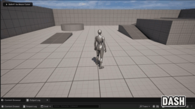

# Ability System Lite (UE5 C++ Code Sample)

A small Unreal Engine 5 gameplay subsystem demonstrating **clean C++ structure**, **modular design**, and **data-driven tuning** through a lightweight “Ability System”.

This is intentionally not a full gameplay prototype. The focus is a **reusable gameplay framework component** that could live inside a real project.

<!--[Ability System Demo](Docs/AbilitySystemSampleShowcase.gif)-->

 

## What this shows

* **Separation of responsibilities**

  * *AbilityComponent* owns abilities, routes activation requests, tracks cooldowns, and exposes events.
  * *Ability base class* defines a polymorphic interface (`CanActivate`, `Activate`) for concrete abilities.
  * *AbilityData (DataAssets)* provide tuning/configuration without recompilation.
* **Non-trivial logic**

  * cooldown end timestamps + timers
  * ID-based ability registry
  * activation failure reasons
  * event broadcasting / defensive checks
* **Minimal Blueprint usage**

  * DataAssets for tuning
  * Projectile uses a BP child for visuals/debug (C++ drives logic; BP hooks are optional)

---

## How to run

1. Open the `.uproject` in **Unreal Engine 5.x**
2. Build (Development Editor is fine)
3. Play In Editor (PIE)

### Controls / Inputs

* **1** → `Dash`
* **2** → `Projectile`
* **3** → `PulseScan`

Output is observable via:

* Character movement (Dash)
* Spawned projectile (Projectile)
* Debug sphere + log listing scanned actors (PulseScan)
* Output Log + optional on-screen debug messages (activation/cooldowns/failures)

---

## Abilities included

### Dash

Impulse-based forward movement. Tunable in `DA_DashAbility` (strength, cooldown).

### Projectile

Spawns a projectile actor. Collision/impact is handled in C++ and can optionally trigger Blueprint events for debug/FX. Tunable in `DA_ProjectileAbility` (speed, lifespan, cooldown, etc.).

### PulseScan

Instant sphere query around the player; logs found actors and optionally draws a debug sphere. Tunable in `DA_PulseScanAbility` (radius, channel, debug draw).

---

## Architecture overview

### `UAbilityComponent` (owner / manager)

* Lives on the actor (player character)
* Builds the runtime registry of abilities from `AbilityDataAssets`
* Public entry point:

  * `TryActivateAbility(FName AbilityId)`
* Cooldowns:

  * stored as end timestamps in a map
  * remaining time computed from `WorldTimeSeconds`
* Events (C++ multicast delegates):

  * `OnAbilityActivated`
  * `OnAbilityFailed` (includes fail reason + cooldown remaining)
  * `OnCooldownChanged`

### `UAbility` (polymorphic unit of behavior)

* Instanced as a UObject owned by `UAbilityComponent`
* Holds:
  * `AbilityId`
  * `UAbilityData*` pointer (tuning/config)
  * owner component reference
* Overridable surface:
  * `CanActivate`
  * `Activate`

### `UAbilityData` (data-driven config)

* DataAssets define:
  * `AbilityId`
  * `AbilityClass`
  * `CooldownSeconds` (+ optional duration field for future extension)
* Ability-specific derived DataAssets define tuning fields (e.g. dash strength, projectile speed, scan radius)

---

## Adding a new ability (quick guide)

1. Create a new ability class: `class UMyAbility : public UAbility`
2. Create a new data asset type: `class UMyAbilityData : public UAbilityData`
3. Implement behavior in `CanActivate/Activate` (read tuning from `GetData()` cast)
4. Create a DataAsset instance in the editor:

   * set `AbilityId`, `AbilityClass`, cooldown/tuning values
6. Add the DataAsset to `AbilityComponent.AbilityDataAssets`
7. Bind an input to `TryActivateAbility("MyAbilityId")`

---

## Content / Assets

This repo includes minimal required assets:
* DataAssets: `DA_Dash`, `DA_Projectile`, `DA_PulseScan`
* Blueprint projectile (visual/debug child): `BP_AbilityProjectile`

---

## Repository layout (high level)

* `Source/.../Abilities/` – ability framework and implementations
* `Content/Abilities/Data/` – DataAssets
* `Content/Abilities/` – minimal BP projectile + any small supporting assets

